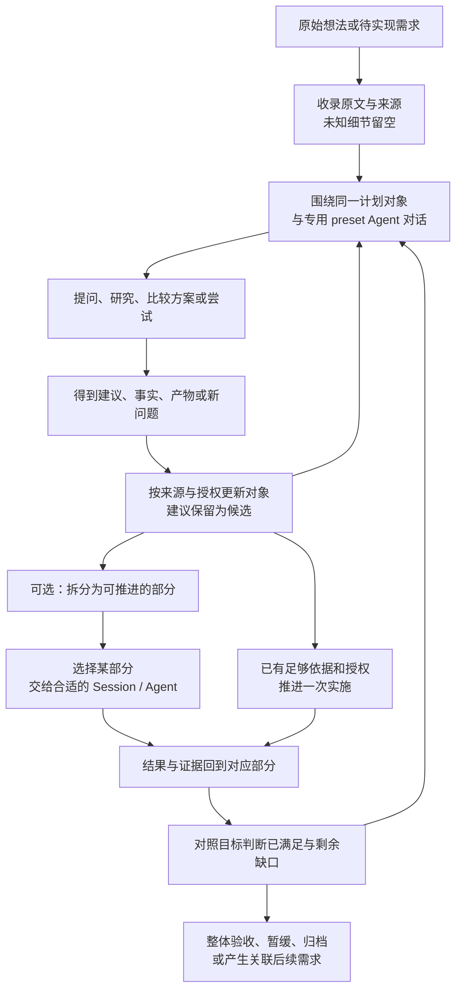
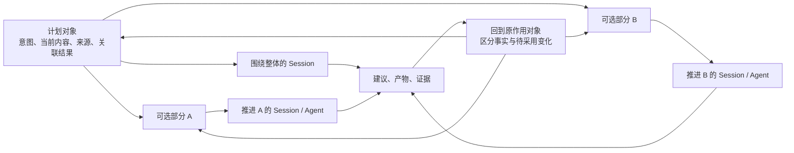

# 交接：计划记录后如何持续发展与推进

整理日期：2026-09-29。来源：本会话「设计计划记录后的操作链路」、本地历史抽样报告，以及本会话已经完成的实现与接入记录。

本文面向继续讨论产品设计的人或 Agent，可独立上传到 GPT 网页阅读。重点是计划对象的产品目标、记录后的操作链路、Session 如何推进对象、演变图及相关边界。Skill 评价与“需求澄清与成形”Skill 的详细设计另有交接，不展开在这里。

## 1. 从哪里继续

用户已经有一个能保存想法、安排泳道、补充内容与记录来源的计划池。新的问题是：记下来之后，用户怎样与 Agent 持续发展同一件事，怎样拆分、研究、执行、看结果，而不必自己管理一堆会话和复制上下文。

已经明确的主方向：从一个想法或待实现需求出发，围绕持续存在的计划对象，与特定 preset 的 Agent 对话来推动它发展。Session 承载具体对话和工作，计划对象组织这件事的长期连续性。

默认组织中心是计划对象。用户否定了先围绕“协作线程”“协作会话／执行会话／复盘会话”等形式搭骨架的方案。这不意味着禁止 Session，而是 Session 的划分应服务于对象的实际推进。

建议网页端开场消息：

> 请基于这份交接继续设计“计划记录后的操作链路”。沿用我已经确认的对象中心方向：从想法或需求出发，与特定 preset 的 Agent 对话；Session 推进对象，成果回到对象。请区分我确认过的取舍、可选点子、助手候选方案和已验证的实现。优先拿出具体、有价值的操作与结果，不要重新围绕会话分类、输入框案例或泛泛的“保持连续性”展开。

这份交接由助手整理。用户引文和明确采用意见，与助手的设计解释、当前代码记录具有不同性质。不要把后者升级为用户硬性要求。

## 2. 起点：已有计划池解决了什么，还没回答什么

最初截图中有项目选择、想法收录、搜索、收集箱／现在／接下来／稍后／停放、单条计划详情、来源、继续补充、估计、范围、验收、移动与归档、依赖和复盘等入口。

用户的原始问题：

> 这是最近完成的计划功能，是可以记了，但是记了之后的链路呢？可以如何操作？如何设计。

随后用户强调：

> 按钮事件是不是有点过时了？肯定得有选择计划对象后的AI交互部分吧。

这说明需要围绕选中的计划对象进行有上下文的 AI 交互。它不是对所有按钮的禁令；移动、归档、查看来源等直接操作仍可存在，具体布局尚需设计。

## 3. 用户已明确表达或采用的关键取舍

### 3.1 计划对象作为组织中心

用户原话：

> 你还是在用形式思维，有没有可能用计划对象思维更好。

> 我的设想也是从一个想法或待实现需求出发，跟一种特定preset的agent对话以推动想法的发展。

因此，不能再把不同阶段的 Session 列表本身当作产品主体。用户打开的是同一件正在发展的事，可以继续讨论、研究、改方案或实施其中一部分。

### 3.2 复用现有能力，页面可以独立设计

用户提供现有 DSH 输入区域截图后说：

> 不能复用这个吗？建个特定preset和特定的UI，进入计划功能后UI就不用被系统UI绑架了，重写页面都行。

应保留现有对话、输入、附件、模型、权限等能力的复用途径。Planning 可以有专门页面与交互组织，不必受系统聊天页布局限制。

但是，用户后来明确否定将“输入框复用案例”继续当成需求演绎研究的价值证明。复用是已表达的设计取舍；输入框案例不再作为核心研究案例反复展开。

### 3.3 多个 Session 可能推进同一需求

用户要求整理历史 Session 时特别指出：

> 注意有很多会话可能指向同一个需求。

> dsh里的先不用管，先按你说的非全量，然后就是注意重点是研究需求对象的演绎。

研究单位应是需求对象的演变，而不是给每个 Session 写摘要。一次会话也可能包含多个对象的不同片段；这类归属仍需要证据，不能仅凭标题合并。

### 3.4 模块拆分是用户提出的可选能力

用户原话：

> 我提一个，可选的想法功能点：把想法需求分解为可落实的几个不同模块，可以分别用不同session、agent来推进某一部分。

这是可选功能，不是所有想法创建时都必须拆分。不同 Session、Agent、preset 是推进某部分的手段。产品能力也不等于当前接手 Agent 获得了代理委派授权。

### 3.5 先完成共同基础，候选发现可外挂

助手曾进一步提出从生活和工作中发现意图、验证后再转为可执行结构。用户认为有一定价值，但指出可以由 Skill 或脚本定时提出候选，要求先完成当前产品范式的共同基础。

因此，自动发现、定时扫描、主动唤醒不是这轮共同基础的必需前置。这个意见也没有授权创建任何定时任务。

### 3.6 原始想法允许不完整

用户在“非目标未进入计划字段”的问题上明确要求：

> 先想清楚收益和潜在副作用，允许为空，这些很多都是我没确认的，别稀里糊涂就把我的需求限制死了。

> 我觉得这种细分工作应该在计划系统里完成，而不是在提交想法、需求时由提交者做。

收录阶段应能保留用户原文。范围、验收、非目标、拆分和估计等细节，可以在系统内逐步发展。不要为填满字段，把助手推测写成用户承诺。

## 4. 用户已经同意的共同基础

用户对下列描述回答“同意”，随后要求画图检验设计。这是一组已获方向认可的能力，并不表示每项都已实现或验收。

> 用户打开一个想法，可以：
>
> - 看到当前被接受的目标、范围和验收。
> - 让 Agent 提出一次结构变化，例如拆成三个部分。
> - 审核后，一次性接受整组变化。
> - 为任意部分启动不同 Agent、preset 和 Session。
> - Session 结束后，结果回到对应部分，形成可审核的更新。
> - 换 Session 或重启后，仍能继续同一对象或其中某一部分。
> - 子项全部完成也不会自动宣称父目标完成；父对象有自己的整体验收。

这里的“当前被接受的目标、范围和验收”需要与后续“允许为空”结合：只展示已经形成的内容，不能为了展示这些栏目而强制用户预先确认全部细节。

“审核整组结构变化”适用于 Agent 提出的结构调整；不能扩展成所有明确的用户操作都要重复确认。

## 5. 记录之后的链路，应怎样理解

以下是对已认可方向的整理。箭头表达关系与可选推进路径，不是每个对象都必须走完的固定阶段。



关键操作与应看见的结果：

| 用户意图 | 产品需要支持的操作 | 操作后的可见结果 |
| --- | --- | --- |
| 先记住一句话 | 保存原文及来源，不要求先做分析 | 找得到原始表达，未知细节仍未知 |
| 继续完善 | 打开对象，与合适的 Agent 对话 | 当前理解得到有依据的更新，而不是只多一段聊天 |
| 看看有没有更好的方案 | 研究、比较、试验，保留候选 | 能比较方案及其依据，未采用内容不冒充当前决定 |
| 拆开推进 | 提出模块及关系，查看整组变化并采用 | 每部分有自己的推进入口，仍关联父目标 |
| 换会话继续 | 将必要对象上下文交给另一个 Session | 能继续同一对象或某部分，不必复制整段历史 |
| 开始做某部分 | 明确这次采用的内容和授权，复用现有执行能力 | 执行有确定作用对象；后续讨论不静默改写已交付范围 |
| 查看实际进展 | 将产物和运行证据回挂 | 能判断支持了什么、还缺什么，不以聊天结束代替完成 |
| 纠正或否决 | 更新受影响内容，保留来源和变化 | 被否决方案不继续作为当前方案，其他有效内容保留 |
| 看为什么变成这样 | 打开演变与原始证据 | 看到关键变化、关联讨论及适用版本 |

这张表是产品行为整理，其中具体交互形式、默认动作和确认颗粒度仍需验证。

## 6. 为什么高于 Session，又能被 Session 推进

“高于”指产品身份和组织层次：一个对象可以跨多次对话持续存在；它不需要与任何一个 Session 的生命周期相同。它并不自动获得更高权限，也不取代执行系统。



用于设计的职责划分：

图中的回写分支表示可能的目标；一次结果应回到该次工作绑定的对象或部分，不是同时写入所有节点。

| 内容 | 建议由谁拥有 |
| --- | --- |
| 正在推进哪件事、当前接受了什么、哪些还未定 | 计划对象及其修订／候选内容 |
| 某次讨论的消息、工具调用、运行上下文 | 原生 Session |
| 该如何研究、提问、提出变化或推进某部分 | Agent 与 preset／Skill |
| 执行派发、运行、验证和恢复 | 既有 Delivery／Queue 等执行能力 |
| 实际产物和证据 | 原拥有系统；Planning 保存可追溯关联 |

设计需要检验的具体问题包括：切换对象后运行中的 Session 是否仍写回原对象、Session 在旧修订上工作时如何处理新修改、同一 Session 的多个对象如何区分。这些是后续设计问题，不应在缺少案例时先扩展成庞大的编排系统。

## 7. 和 note、记忆、任务系统的关系

用户明确质疑过：DSH 已经有 note，为什么又用“保持连续性、维护共识”等笼统职责解释 Planning。这个质疑仍应约束后续设计。

不能只用“记录决策”“保存上下文”“沉淀经验”证明新增系统的必要性。需要在具体操作上说明已有 note 是否能直接完成，哪里需要适配，哪里确实缺少能力。

当前设计理由是：计划对象承载“这件事当前是什么、如何继续推进”的可操作身份；note 和记忆仍可承载解释、经验或来源材料。现有实现记录将单 Session Goal、Delivery、Queue、Project Memory 与 Planning 分开，避免另造执行或记忆状态机。

这不等于已经证明任意 note 方案都不适合。接手时不要假称完成了对 DSH 所有 note 能力的穷尽对比；若新增能力与它重叠，应查实际契约再决定复用方式。

## 8. 历史研究：哪些可用，哪些被排除

### 已存在的研究材料

本地有两份文件：

- `.artifacts/requirement-evolution-study/2026-09-28-sample-study.md`：报告称抽样 11 个 Codex 主会话，时间范围为 2026-09-08 至 2026-09-28；未读取 DSH 内部 Session，未做全量归档。
- `.artifacts/requirement-evolution-study/2026-09-28-planning-redesign.md`：基于当时报告形成的产品与交互提案。

本次整理回读了上述文件，没有重新逐条审核全部原始日志。报告中的历史定位可用于继续查证；助手归纳不能自动变成用户决定。

### 后续用户缩小了认可范围

用户明确说：

> 我只认可浏览器案例和之前已完成的计划案例，这个计划案例的后续暂时不算。

所以，旧研究报告原有三个案例，并不代表用户认可全部三个。继续讨论时：

- 使用浏览器案例和用户认可的此前 Planning 案例。
- 不再以输入框案例证明系统价值。
- 不把本轮 Planning 后续设计当作已经发生并证明价值的历史案例。
- 不能用自己刚提出的功能，再反过来论证这个功能必要。

用户还明确要求发散既要能基于案例，也要有不依赖案例的新构想；历史研究是来源之一，不是所有点子必须遵循的上限。

### 浏览器案例的可追溯材料

报告记录的用户目标：只给浏览器业务任务，个人 DSH Agent 能自主找到流程，在真实浏览器中完成可核验操作；遇到页面漂移、歧义或未知写入结果，依据新观察恢复，避免重复副作用。

代表性转折：

| 历史片段 | 所揭示的区别 | 报告提供的 thread 定位 |
| --- | --- | --- |
| 扩展尽量保持稳定、简单，不妨碍 DSH/Codex 能力 | 总目标与可独立推进的支撑模块可分开 | `01a0dad3-5baa-7d41-8182-dfa036e9b1bf` |
| 工具已出现，但不能发现或读取真实标签页 | 组件存在与用户可用不同 | `01a0dbea-14b9-7650-ae65-4a65315b86f7` |
| 创建 GitHub Issue 要查重、提交一次、最终读回 | 实际业务结果与副作用恢复需要具体证据 | `01a0dc37-f2bb-7ab3-87ff-4e53e227a513` |
| 验收只给业务任务，不指定工具顺序 | 手工指定流程成功与 Agent 自主使用成功不同 | `01a0e5c8-965a-76e1-874c-c57db2de921c` |
| 回到个人正在使用的入口验收 | 隔离验证不能覆盖个人实例 | `01a0e5e3-f276-7130-9467-ac795563c6cf` |

这些可支持的设计假设包括：把支撑模块作为关联工作；让每份证据说明覆盖的目标；把运行事实带回对象而不改写用户目的。用户已经否定过泛泛的“缺失点”归纳，因此仍需把假设落实为可观察的操作与收益，不能声称上述归纳已全部被用户认可。

### 此前 Planning 案例的材料与局限

报告中的早期材料包括：普通自然语言识别规划意图、用户担心持续执行失控、希望保存会话生成的需求图与 UI 图。

| 材料 | 报告提供的定位 |
| --- | --- |
| 不要求用户说结构化提示词，倾向 Skill 识别意图 | thread `01a0dfff-aac5-7943-940e-c9dd06e34cf1`；message `01a0e05e-dd33-7910-a192-2c99dd191f2f` |
| 担心执行没完、效果差 | thread `01a0e1d3-eb6f-74a1-a439-28dbc9a0266f`；message `01a0e1d4-8cb5-7e83-a48b-1d0130475a8d` |
| 保存需求图与 UI 图 | thread `01a0e195-84f4-7c73-9a1d-9869ca5aa243`；message `01a0e2ad-e92a-78c2-8043-475dc8252ec3` |

报告承认没有定位 Planning 最早提出的原始会话。它也没有精确定义用户所说“之前已完成”的版本边界。继续做正式案例图或导入时，应沿着来源补证，不把整个报告及本轮后续内容都归为“已完成案例”。

## 9. 演变图是一个明确提出的需求

用户先说每个计划对象可能需要演变图，随后问：

> 演变图可以不用token而自动根据资料、数据实时生成吗？把之前日志分析过的浏览器、planning画一下。

随后用户要求将它写入 Planning，并把 MCP 的能力缺口作为另一项需求记录。

### 演变图要表达什么

围绕同一对象，显示原始表达、候选方案、采用与否决、修订、关联工作、产物与证据，让用户能够回到来源。待定或否决方案不成为当前被接受的主干；事实证据不擅自改写用户目标。

“从结构化数据生成视图不调用模型”和“从任意历史聊天自动理解需求”是不同的承诺。前者可由确定性投影与布局实现；历史资料归属、语义解释和变化提取若尚未结构化，仍可能需要模型或人工整理。不能把第二项成本隐藏在第一项的“零 token”声明里。

### 已记录需求一

- 标题：为每个计划对象自动生成实时演变图。
- item_id：`plan-03ee23a2-9fc9-438a-bf36-e7aac87d6df7`。
- 最初写入回执中的 revision_id：`plan-revision-5cd4b60f-7472-4966-b264-6ce2d568b430`。
- 当时状态：独立 active item，lane 为 inbox。该状态是历史回执，不保证未来不变。

当时回读的验收摘要：

1. 相同结构化事件生成完全一致的演变图。
2. 生成、刷新和布局没有模型调用。
3. 能重建浏览器需求演变图和 Planning 连续性案例演变图。
4. 每个节点能回到精确 Session／turn／message、内容版本或运行证据。
5. 否决候选不进入当前对象投影；事实证据不擅自改写用户目标。
6. 刷新及新 Session 读取后图结构一致。

这组摘要来自本会话中用户转述的 DSH 写入结果。用户后来提醒很多细节未确认，不能据此把每条具体口径永久冻结；设计变更应回到同一需求明确修订。

### 当前实现记录与剩余缺口

本地实现记录描述：Planning 从 Board 快照派生演变视图，节点包括来源、Proposal 代次、已采纳修订、复盘、依赖和 Delivery 交接；它不调用模型，也不虚构 Board 没保留的历史泳道或依赖值。

这是已有实现边界，不等于两套真实历史案例已全部准确导入、来源定位已补齐、演变图 UI 已经通过用户验收。此次交接没有重新执行完整演变图验收。

## 10. 记录入口与系统内发展的边界

之前两项需求入库时，提交者发现 create 结构没有“非目标”字段，因而没有将非目标正文存入该字段。用户反对将细分工作压到提交者，并强调不少内容尚未确认。

从这次纠正应保留的产品原则是：

- 收录者可以只带入原始表达及必要来源。
- 系统内的 Agent 再帮助澄清、比较、拆分和形成候选内容。
- 字段暂时无法表达的原文不应悄悄丢失，也不应硬塞进验收条件造成新的承诺。
- 不完整并不等于无效；未知估计和边界可以继续未知。
- 录入想法、采纳方案、授权执行、确认验收是不同操作，不应因前一步发生而自动推导后一步授权。

本地实现记录现在描述：非结构化收录进入 pending Proposal，采纳其精确代次才成为 active item。与之不同，早先两项需求回执显示它们直接创建为 active item；这是不同时间的行为记录，不要把历史卡片状态误读为新收录入口仍然直接采用想法。

另一个必须保留的教训：用户要求直接修改本地 YAML 时，助手曾错误地把它引向 Planning。用户明确反对。Planning 应用于需要持续发展的对象，不应变成普通配置修改或已授权工作的强制关卡。

## 11. MCP 接入是支撑能力，不能绑死产品

### 已记录需求二

- 标题：为 codex-dsh MCP 增加 Planning 查重、读取与提案写入能力。
- item_id：`plan-8e191925-3eeb-4923-b3cc-e81c57504e52`。
- 最初写入回执中的 revision_id：`plan-revision-9f14de70-c6c3-46f6-b420-b49716583c14`。

原验收方向包括：新 Codex 会话仅通过原生 MCP 查重、读取、提交 Proposal 与读回；相同 request id 不重复写入；不允许伪造 actor 或 Session；MCP 收录不获得 Memory 接受、Delivery 派发或验收权限。后续多项目设计调整了“只能固定一个 Workspace”的接入方式，访问隔离应以连接获准的项目及本次选择来解释。

### 已纠正的不合理设计

早期方案把 Workspace 固定在启动配置里，并提出用 Planning 专用网关替换原网关。后来确认这种做法会限制多项目服务，而且丢掉旧会话、浏览器能力。

用户要求继续处理的方向是：保留统一 DSH 连接器，向它增加 Planning 能力；使用当前项目，涉及其他项目时明确选择；Host 校验范围并固定身份与操作权限。用户不应为启用功能自己查 UUID 或处理令牌传递细节。

### 截至本会话最新交付记录

- 本地 master 已包含 `61a805e565`，未推送远端。
- 原有 8 个工具保留，新增项目发现、计划查找、对象读取、提案收录 4 个工具。
- 连接器优先使用单个 MCP root 作为当前项目；未提供 roots 时使用其工作目录；多个 roots 要求明确选择。
- Host 允许按调用选择获准项目，支持配置项目路径白名单。凭据由私有文件或环境变量提供，不要求服务只绑定一个项目。
- 3080 通过热加载启用；本轮无需重启 Host 或 Codex。
- 11 个相关测试通过；实际 MCP SDK 客户端能使用新旧工具、切换项目，并读回上述两条需求。
- 当前 Codex 对话仍缓存旧原生目录；“新 Codex 对话仅靠原生 MCP 完成提案写入和读回”的验收尚未完成。本轮没有为验证向个人计划池写入测试需求。

这些是本会话上一轮的验证记录，此次整理未重新连接活动服务。它们证明接入能力的一部分，不能替代整个对象协作 UI 与 Agent 行为的产品验收。

## 12. 页面设计中仍可复用的候选内容

旧重设计稿提出过：对象导航、对象工作面和原生对话区并列；对象内提供当前理解、演变、资料与成果；局部建议在受影响位置展示；切换对象保留草稿，运行工作仍绑定原目标。

这些可以作为候选原型素材，但没有证据表明用户已接受最终三栏布局、栏目名称、默认排序或所有操作细节。接手时应从已确认的用户操作出发选择呈现方式，不要把旧稿当作批准后的 UI 规格。

用户明确要求过先画设计层面的图，解释对象如何高于 Session 又由 Session 推进。此时需要的是对象关系、操作与写回关系、演变和执行边界，不应直接用新的 UI 效果图替代这些问题。

## 13. 还没有完成的产品设计工作

下面是从当前材料整理的开放问题，不是要求用户逐项填写的表单，也不是全部需要在第一版完成的承诺。

1. **选中对象后的第一步。** 页面与 Agent 怎样让用户立即开始有效讨论，同时避免每次先生成一份计划。
2. **拆模块后的具体推进。** 用户如何选择某部分、交给一个 Session 或 Agent、查看结果并回到整体；哪些情况下值得拆。
3. **结构变化的整体采纳。** 用户怎样看清拆分、合并、关系或范围变化，一次采纳整组内容，而不把部分旧状态留下。
4. **Session 的输入与写回。** 带入哪些对象信息、如何按需回查来源、如何处理执行期间发生的对象修订。
5. **建议、共识与事实的呈现。** 保留区别，同时不增加一套繁琐管理工作。
6. **父目标的完成判断。** 子项完成后还需要哪些整体验证，怎样展示缺口与已成立证据。
7. **演变图的数据基础。** 已有修订、来源和执行关联能画出什么，哪些历史确实缺数据；实时刷新与完整重建能否一致。
8. **已有能力复用。** note、Session、Delivery、Queue、Memory 已经承担什么，只补必要关联和交互，不再平行造一套。

用户希望有真实、有价值的赋能点，也希望头脑风暴能够提出不同方向；不要把同一底层假设上的多个小功能包装成多个产品范式。当前优先的是已经同意的共同基础，额外构想可以作为候选，不强行纳入范围。

## 14. 接手时应避免的回退

- 又以会话阶段分类或聊天线程列表作为产品中心。
- 又把输入框案例作为主要研究依据。
- 用本轮尚未完成的 Planning 后续讨论证明方案已经有效。
- 把模型提出的非目标、约束、验收或估计写成用户已经确认。
- 把“允许为空”误解为不能在系统内主动发展需求。
- 把拆模块、启动多个 Session／Agent、每轮生成计划变成强制流程。
- 把收到想法直接解释为执行授权，或把测试通过解释为用户已验收。
- 宣称任意历史日志的理解、归属和结构化都无需模型成本。
- 用重新实现 note、执行调度或记忆系统替代具体产品操作设计。
- 把普通已授权配置修改也强制送进 Planning。
- 在没有用户明确要求时使用子代理。当前规则不因历史上曾授权并行而失效。

## 15. 本地材料索引

网页端通常不能直接读取本地路径；正文已提供继续讨论所需的主要内容。回到 Codex 后可以按需读取：

```text
仓库：C:\Users\xbh\deepseek-harness
历史抽样报告：.artifacts/requirement-evolution-study/2026-09-28-sample-study.md
旧产品设计提案：.artifacts/requirement-evolution-study/2026-09-28-planning-redesign.md
当前架构记录：.agents/notes/implemented/architecture/2026-09-27-project-planning-and-execution-boundaries.zh.md
接入交付记录：.artifacts/planning-gateway-delivery-20260929.md
接入实际验证输出：.artifacts/planning-connector-live-20260929.jsonl
另一个主题的交接：outputs/2026-09-29-requirement-shaping-handoff.md
本次交接：outputs/2026-09-29-planning-object-workflow-handoff.md
```

原始会话标识：`01a0e84a-9c8a-7793-83a8-8582bc1bb256`。两份旧研究包含这个仍在继续的会话，使用其中结论时须应用本会话后续的纠正。

本次仅整理交接文档，没有修改计划数据、产品代码、Skill 或运行配置，没有启动子代理。
